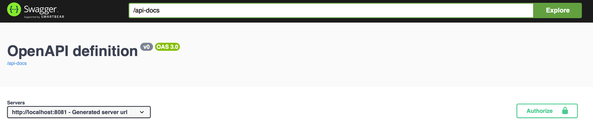

# spring-boot-users-posts

A simple Spring Boot application that manages users and user posts. It utilizes REST APIs, Spring Security, an H2 database, and containerization

### Run the application locally with Docker
1. Build and package the project with Maven. Ensure Maven is installed on your machine and fire up a terminal on the project root:  
`mvn clean package`
2. Ensure Docker (and docker-compose) is installed
3. Build and start up the auth server and the app containers by running  `docker compose up --build`
4. Start playing around with it!

### Open API Specs
1. This application uses OpenAPI 3.0 and auto generates the specs. You can view the APIs [here](http://localhost:8081/swagger-ui/index.html)

### Authorization
1. On the Swagger page, note the Authorize button on the right. You will need to generate an auth token to be able to successfully send requests
   
3. Ensure Postman is installed
4. Open this [Postman Collection]([Spring Boot Demo.postman_collection.json](Spring%20Boot%20Demo.postman_collection.json))
5. Expand the Auth folder and on the `initial access token` request, hit Send. No need to change anything. This will generate the access token and store it in an environment variable so there is no need to copy anything.

### API Requests
1. When the auth token has been generated, you can start playing around with the APIs. You can even test them without auth and see you'll get 401 responses.
2. Populate the database with users and posts by expanding the `Users` collection and hit `Send` on the `Fetch users from API` - this makes a REST call to an external API that returns data for users and posts
3. You can retrieve a list of users and their posts with the `Get all Users and posts` request.
4. Play around with all the other APIs as you see fit!